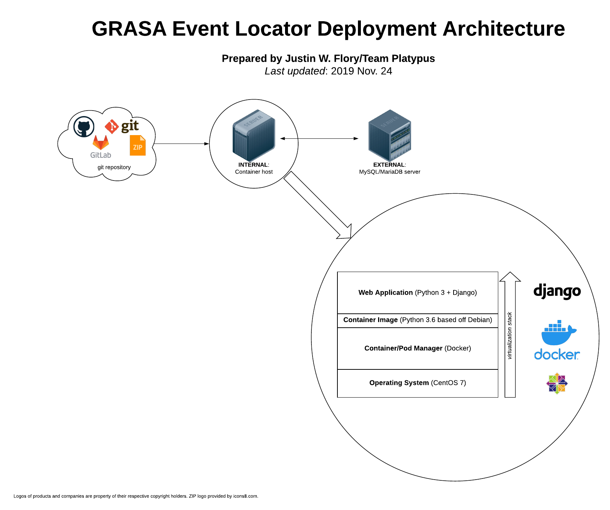

Deployment architecture
=======================

This document explains the anticipated deployment architecture of the GRASA Event Locator.
At the most simple form, a production environment for the Event Locator will look like this:

The bottom-right circle is a "closer look" at how the Container Host works:

* **Operating System**: CentOS 7 (7.6+ preferred)
* **Container Manager**: Docker (installed to base Operating System as a hypervisor of sorts)
* **Container Image**: Container Manager starts with Container Image pulled from [Docker Hub](https://hub.docker.com/), a repository of Docker container images
    * In this case, the base Container Image is the official [`python:3.6-stretch` image](https://hub.docker.com/_/python), which in turn is based off of a minimal Debian image.
* **Web Application**: GRASA Event Locator source code copied into Container Image and ran as Python 3/Django 2 web application
