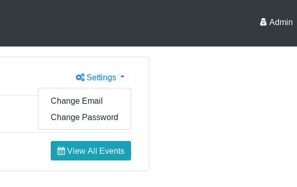
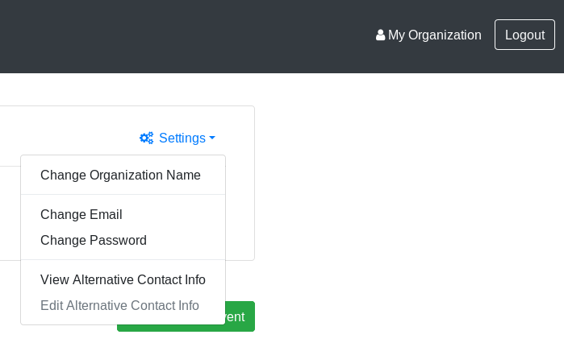

Change password
===============

This page explains how to change the password of either an Admin or Provider account.

## Admin User

1. Navigate to _Admin Portal_ page by clicking on _Admin_ button in top-right corner.
   _Admin Portal_ opens.
2. Look for _Settings_ drop-down menu in the center-right part of the screen.
3. Click _Change Password_:

   

4. The _Change Password_ box appears.
   Enter the current password, the new password, and confirm the new password.
5. Click _Save Changes_.

The password is now changed.

## Provider User

The Provider password change experience is similar.

1. Navigate to _Provider Portal_ page by clicking on organization name button in top-right corner.
   _Provider Portal_ opens.
2. Look for _Settings_ drop-down menu in the center-right part of the screen.
3. Click _Change Password_:

   

4. The _Change Password_ box appears.
   Enter the current password, the new password, and confirm the new password.
5. Click _Save Changes_.

The password is now changed.
