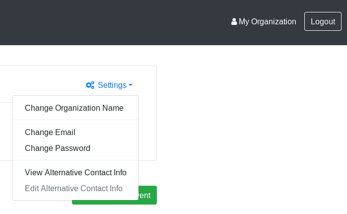

Update email
============

This page explains how to change the email of either an Admin User or a Provider User.

## Admin User

1. Navigate to _Admin Portal_ page by clicking on _Admin_ button in top-right corner.
   _Admin Portal_ opens.
2. Look for _Settings_ drop-down menu in the center-right part of the screen.
3. Click _Change Email_:

   

4. Enter the new email in the text box and click _Save_.
5. A notification email is sent to the old and new email addresses.

## Provider User

The Provider password change experience is similar.

1. Navigate to _Provider Portal_ page by clicking on organization name button in top-right corner.
   _Provider Portal_ opens.
2. Look for _Settings_ drop-down menu in the center-right part of the screen.
3. Click _Change Email_:

   

4. Enter the new email in the text box and click _Save_.
5. A notification email is sent to the old and new email addresses.
