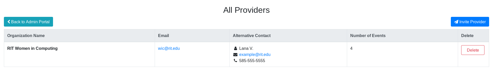

How to invite a Provider to sign up
===================================

This page explains how an Administrator can invite a Provider to sign up for the Event Locator via email.

## 1. Click _View Providers_ button from Admin Portal:

## 2. Click _Invite Provider_ button in upper-right corner:

## 3. Enter email and click _Send Invite_:

## 4. Wait for registration

Once _Send Invite_ is clicked, an email with instructions to register is sent to the email address.
It is up to the Provider to finish the registration.
Their account is not created when they are invited; the invitation only prompts them register and start adding Events.
