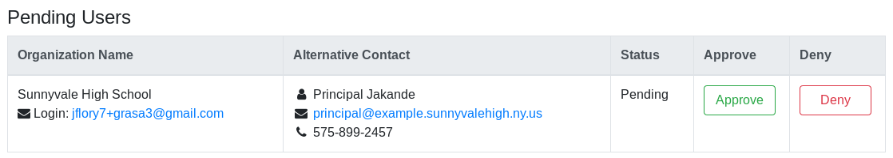

How to review Provider account registrations
============================================

This page explains how an Administrator reviews new Provider account registrations.
New account registrations are either Approved or Denied.

## View pending accounts

If there are pending accounts awaiting review, they appear on the **Provider Panel**:

The **Provider Panel** is accessed by clicking the organization name next to the _Logout_ button:

## Approve an account

To approve an account, click _Approve_ next to their entry in the _Pending Users_ table.
Once approved, the Provider and their organization contact are sent an approval notification via email.

## Reject an account

To reject an account, click _Deny_ next to their entry in the _Pending Users_ table.
You are prompted for a rejection reason:

Once rejected, an email is sent to the Provider with the provided rejection reason.
They are instructed to follow up with an Administrator for info if needed.
