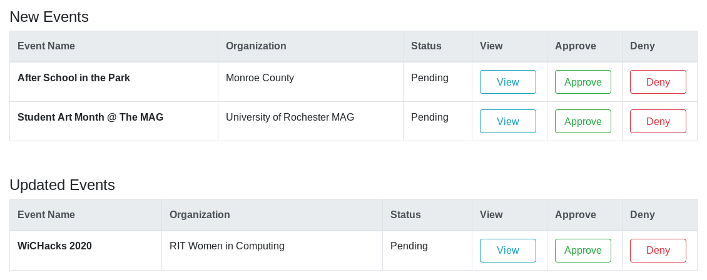
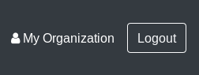
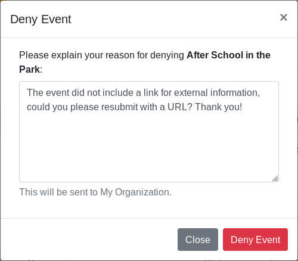

How to review and publish Events
================================

This page explains how an Administrator reviews Events to publish in the Search System.
This includes new Events and edits to existing Events.
Since the process is identical, these instructions work for both new Events and edits to existing Events.

## View pending Events

If there are pending Events awaiting review, they appear on the **Provider Panel**:

The **Provider Panel** is accessed by clicking the organization name next to the _Logout_ button:

## Approve an Event

To approve an Event, click _Approve_ next to their entry in the _Pending Users_ table.
Once approved, the Provider and their organization contact are sent an approval notification via email.

## Reject an Event

To reject an Event, click _Deny_ next to their entry in the _Pending Users_ table.
You are prompted for a rejection reason:

Once rejected, an email is sent to the Provider with the provided rejection reason.
They are instructed to follow up with an Administrator for info if needed.
