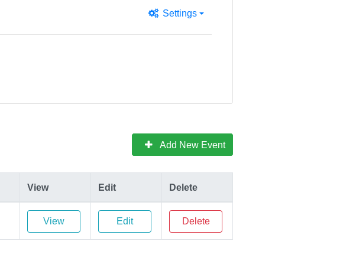

How to create a new Event
=========================

This page explains how to create new Events.
Events are searched on a virtual "bulletin board" of events.
This explains how to create a new Event and other details about writing evergreen content.

## Add new Event

Use the _Add New Event_ button from the **Provider Portal** to submit a new Event for review:

Complete the form on the next page with details about your Event.
Once done, click _Validate Event_.
If you receive feedback about corrections, please double-check the data you entered is correct.
Your new Event awaits approval by an Administrator user (_admins_: see "[How to review and publish new Events](admin-review-event)")

## How to write strategically

Since dates/times are not collected about events, the more metadata a Provider adds, the better chance an Event is found.
The Event Locator is best for recurring events that repeat multiple times in a school year, semester, or term.
If the Event happens only once, **provide a good description and website** for someone to learn more about your program, including when (month, day, year, and time).
The website field is also great for external ticketing sites, e.g. [Eventbrite](https://eventbrite.com).

Worried about getting everything right?
No worries, you will always have opportunities to edit your Event later.
