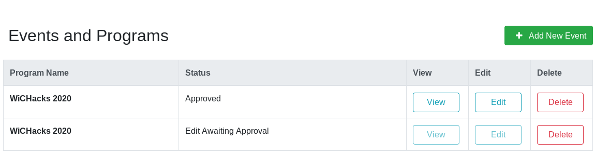

How to edit an existing Event
=============================

This page explains how to edit existing Events.

## Requirements

In order to edit Events, you must be logged in as a Provider user, looking at the **Provider Portal** page.
This also assumes you have at least one Event that is already approved.

## 1. Edit from event list

On the **Provider Portal**, view your list of submitted Events.
Choose the one you want to change and click _Edit_:

 from Provider Portal")

Like with creating new Events, change details of your Event as needed.
When done, click _Validate Event_ near the lower-right corner.
Once submitted, your Event edit awaits review by an Administrator.

## 2. Wait for Administrator approval

While your edit awaits review, you will see two copies of your Event, both with different statuses:

It is _not_ recommended to edit an event again while another event edit is pending.
Once an edit is reviewed by an Administrator (_admins_: see "[How to review edits to existing Events](admin-review-event-edit)"), the Provider receives an email notification of the status change.
If approved, the Event edit is immediately displayed in the public site.
