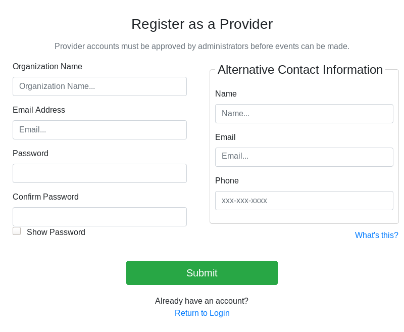

How to register a Provider account
==================================

This page explains how to create a new Provider account in the Event Locator.

## 1. Get an invitation

Typically, a Provider is invited to use the Event Locator by an Administrator.
The invitation email includes a URL to the site registration page (_developers_: [localhost:8000/register.html](http://localhost:8000/register.html)).
A link can also be found from the _Login_ page.

## 2. Complete registration form

The registration form helps Administrators understand who is registering and on behalf of what organization:

* **Information about you**:
    * _Organization Name_: organization/entity/program that Provider is associated with
    * _Email Address_: Provider's email address, used for login
* **Information about your organization contact**:
    * _Name_: Name of someone an Administrator may contact in your organization
    * _Email_: Email address of that contact
    * _Phone_: Best phone number for that contact

Complete the requested information and click _Submit_.
Your request to register an account was received.

## 3. Wait for Administrator approval

Because registration is public and an invitation is not required to register, all new accounts must be approved by Administrators.
New accounts are reviewed by an Administrator before they are activated (_admins_: see "[How to review Provider account registrations](admin-review-account)")
Once an Administrator reviews an account, a status change notification is sent to the Provider's email address.

## 4. Log in

Once your account is activated, you can log in.
Use the _Login_ button in the top-right corner to log into the Event Locator.
Once you enter your credentials, you are redirected to the **Provider Portal**.
