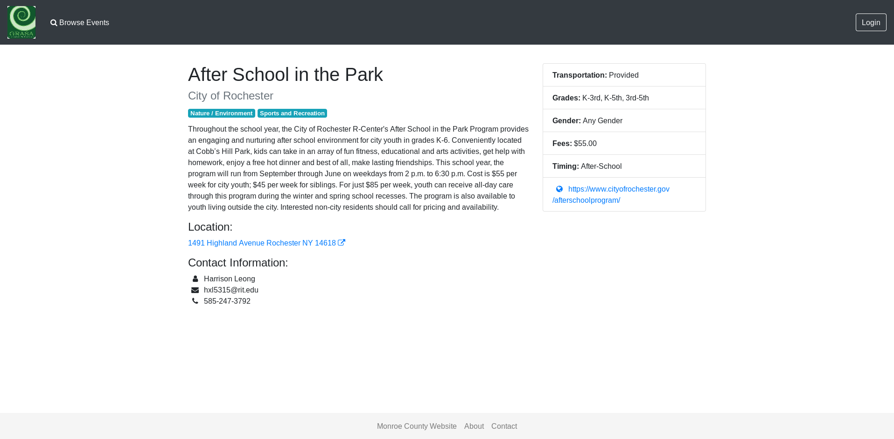

How to share an Event
=====================

This page explains how to share an Event with someone else, either as an email or on social media.
The best way to share an event with others is to load the profile page of an Event.
The profile page of an Event is opened by clicking on the Event entry in the search results.
The URL is unique to a specific Event and can be shared with others.
Someone else will be able to share the detailed view of a specific Event with someone else.

